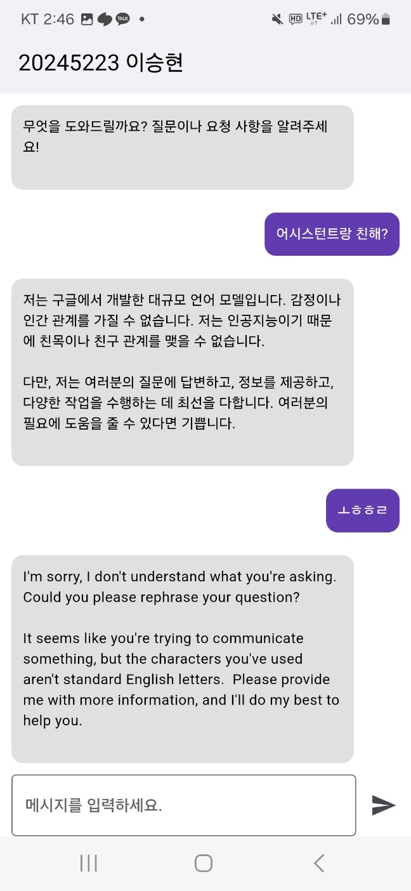

# 📅 Hallym Calendar

> 2024년 한림대학교 하계 계절학기 모바일 프로그래밍 과목 기말 과제
> 
> 구글 로그인과 챗봇이 통합된 스마트 일정 관리 애플리케이션

## 📱 프로젝트 소개

첫 Flutter 프로젝트로, 사용자 친화적인 인터페이스와 AI 챗봇이 결합된 투두리스트 애플리케이션입니다. 일상적인 일정 관리를 더욱 스마트하고 효율적으로 만들어주는 것을 목표로 합니다.

## ✨ 주요 기능

### 1. 다양한 로그인 옵션
- Google 계정을 통한 로그인
- 게스트 모드 로그인 지원

  

### 2. 사용자 맞춤 테마
- 라이트/다크 모드 전환 가능
- 사용자의 선호도에 맞는 UI 제공

  

### 3. 일정 관리 시스템
- 직관적인 일정 등록 인터페이스
- 세부 정보 및 우선순위 설정

  

### 4. 캘린더 통합
- 월별 일정 조회
- 시각적 일정 관리

  

### 5. 투두리스트
- 체크리스트 형식의 일정 관리
- 완료된 일정 표시 기능

  

### 6. AI 챗봇 어시스턴트
- 사용자와 대화형 인터페이스
- 일정 관리 보조 기능

  

## 🚀 향후 개선 계획

### 1. 데이터 동기화 
- Firebase 연동을 통한 크로스 디바이스 데이터 동기화 구현
- 실시간 데이터 백업 시스템 구축

### 2. 위젯 시스템 개선
- 실시간 위젯 업데이트 최적화
- 위젯 간 데이터 동기화 강화

### 3. AI 기능 확장
- 챗봇을 통한 자동 일정 등록 기능 개발
- 더 스마트한 AI 어시스턴트 기능 추가

### 4. 외부 서비스 연동
- Google Calendar 연동 기능 구현
- 다양한 캘린더 서비스와의 통합 계획

## 🛠 기술 스택
- Flutter
- Dart
- Firebase (예정)
- Google 로그인 API
- AI 챗봇 API

## 📬 문의사항
추가적인 정보나 문의사항이 있으시다면 언제든 연락 주시기 바랍니다.
